# Gesture Recognition System for Smart Lighting Control

## 1.Introduction

The goal of this project is to develop a gesture recognition system that enables users to control a smart lighting setup through specific hand gestures. By leveraging pre-trained TensorFlow Lite models, the system aims to provide a more intuitive and convenient way to manage lighting compared to traditional voice recognition methods, which can be slower and require clear articulation to function effectively(Kienzle, 2019). The use of gestures can offer a faster and more seamless user experience, enhancing the convenience and functionality of smart home environments.

### 1.1.Program overview

#### Key Features and Innovations:

- **Real-time Gesture Recognition**: Utilizes a CNN optimized for low-latency to ensure instant response to gestures, enhancing user experience over voice-activated systems.
- **Intuitive Numerical Gestures**: Recognizes numerical gestures (0-9) for a universally understood interface, overcoming language barriers.
- **Adaptive Lighting Control**: Allows nuanced control of lighting, correlating gestures with brightness levels for precise adjustments.
- **Energy-Efficient Edge Processing**: Performs all processing on a Raspberry Pi, eliminating cloud dependency to reduce latency, enhance privacy, and conserve power.
- **Scalable and Flexible**: Modular design supports expansion for additional gestures and smart home device control, ensuring future adaptability.
- **Enhanced Accessibility**: Offers a non-verbal control option, beneficial for users with speech impairments or in noise-sensitive environments.
- **Continuous Learning**: Features a feedback mechanism to improve gesture recognition accuracy over time.
- **Privacy-Focused**: Activates only with deliberate gestures within the camera's view, addressing privacy concerns of always-listening devices.

This system advances smart home interaction by combining advanced machine learning with user-friendly design, offering a natural, efficient, and inclusive method for controlling smart devices.

## 2.Research Question

The primary focus of this project is to explore how a simplified gesture recognition system can be effectively implemented on a low-power device like the Raspberry Pi to control smart lighting. The core question addressed by this research is:

**"How can a gesture recognition system be optimized to achieve high accuracy and real-time performance on an embedded platform for controlling smart home lighting?"**

This research question arises from the need to provide a more intuitive and efficient alternative to current smart home control methods, which predominantly rely on voice commands. The project aims to demonstrate that gesture-based controls, powered by lightweight machine learning models, can offer a viable and user-friendly solution.

## 3.Application Overview

The application developed in this project consists of a gesture recognition system designed to control smart lighting through hand gestures. The system is composed of three main components: the hardware setup, the gesture recognition model, and the software framework. Each component plays a critical role in achieving the desired functionality of recognizing user gestures and translating them into commands for the lighting system.

### 3.1. Hardware Components:

- **Camera Module:** A Raspberry Pi Camera Module V3 is used to capture live images of the gestures. The module has an autofocus function. The camera is positioned so that the user's hand movements can be clearly seen and is directly connected to the Raspberry Pi.

- **Raspberry Pi:** Serving as the core computational unit, the Raspberry Pi is responsible for running the gesture recognition model and processing the input from the camera. It also communicates with the lighting system to execute control commands based on recognized gestures.

- **LEDs:** The LEDs simulate an intelligent lighting system that responds to user commands. They are connected to the Raspberry Pi via GPIO pins, allowing for direct control of their state (on/off) and brightness.

### 3.2. Gesture Recognition Model:

The gesture recognition model used in this project is a 2D Convolutional Neural Network (CNN) trained to recognize numerical gestures (0-9). The model is optimized for deployment on the Raspberry Pi to ensure efficient processing and real-time performance. The key features of the model include:

- **Input Processing:** First perform autofocus to ensure that the collected pictures are clear. Images captured by the camera are pre-processed to match the model's input requirements (2550x 2550 pixels, normalized pixel values).

- **Real-Time Inference:** Due to the author's system compatibility reasons, the system performs image acquisition and image recognition asynchronously, which causes a slight delay, but is still sufficient to provide real-time response.

### 3.3. Software Framework:

The software framework integrates the hardware and model components to create a cohesive system. It consists of two main modules:

- **Image Capture Module:** A Python script running on the Raspberry Pi is responsible for continuously capturing images from the camera. These images are stored temporarily for processing.

- **Recognition and Control Module:** Another Python script processes the stored images using the gesture recognition model. Upon identifying a gesture, the script sends a command to the LED control system via the GPIO interface, adjusting the lighting as specified (e.g., turning lights on/off or adjusting brightness).

### 3.4. System Workflow:

The overall workflow of the system can be summarized as follows:

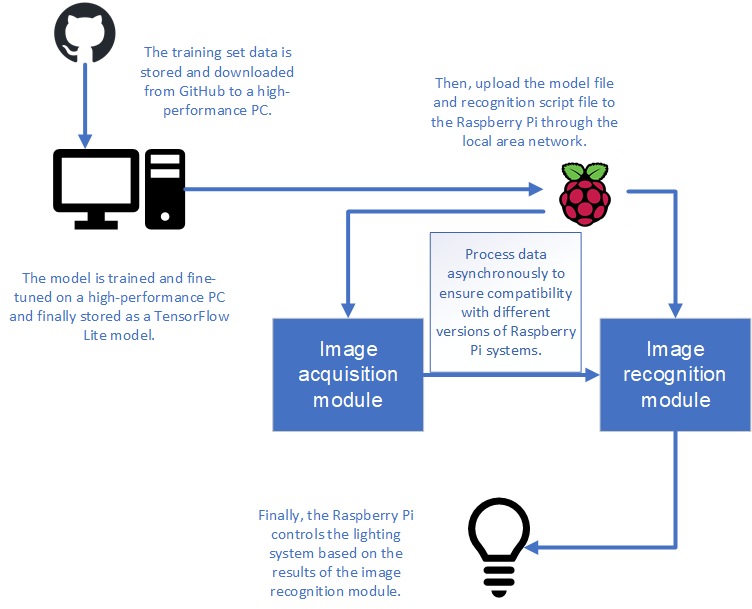

By effectively integrating these components, the application provides a seamless user experience for controlling smart lighting through hand gestures, demonstrating the practical viability of gesture-based control systems in smart home environments.

## 4.Data

The dataset utilized in this study was meticulously curated to support the development of a robust hand gesture recognition system for digit classification. The data collection process was designed to capture a diverse range of hand gestures representing digits from 0 to 9, ensuring a comprehensive representation of various hand shapes and orientations(En-1999, 2020).

### 4.1.Data Collection Process:

A custom Python script leveraging the OpenCV library was developed to facilitate the data acquisition process. The script interfaced with a standard webcam to capture real-time video feed, from which individual frames were extracted and processed. The key components of the data collection setup included:

1. **Region of Interest (ROI):** A fixed 150x150 pixel area was defined within the video frame, spanning from coordinates (100, 100) to (250, 250). This ROI was visually demarcated on the live feed with a red rectangle, guiding participants to position their hands accurately.

The get_roi function was implemented to extract the region of interest from each frame:

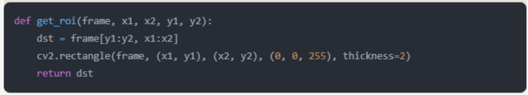

2. **Capture Mechanism:** The script implemented a keyboard-driven capture system, mapping specific keys to each digit (e.g., 'a' for 0, 's' for 1, etc.). This allowed for real-time categorization and storage of captured images.

3. **Storage Structure:** Captured images were automatically saved in a predefined directory structure, with each digit assigned its dedicated subfolder. This organization facilitated efficient data management and subsequent processing.

### 4.2.Dataset Characteristics:

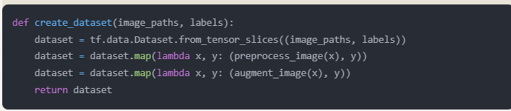

This function creates a dataset that automatically applies preprocessing and augmentation to each image during the training process.

The resulting dataset exhibits the following key characteristics:

1. **Classification Categories:** The dataset encompasses 10 distinct classes, corresponding to digits 0 through 9.

2. **Sample Size:** Each class contains a minimum of 1,000 images, resulting in a total dataset size exceeding 10,000 samples. This substantial volume enhances the model's potential for generalization and robustness.

3. **Image Format:** All images were saved in JPEG format, balancing quality with storage efficiency.

4. **Resolution:** Consistent 150x150 pixel resolution across all samples, derived from the predefined ROI.

5. **Color Space:** Images were captured and stored in the BGR color space, aligning with OpenCV's default color representation.

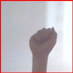
The hand gesture corresponding to 0
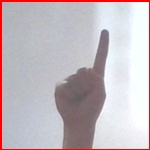
The hand gesture corresponding to 1
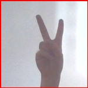
The hand gesture corresponding to 2
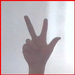
The hand gesture corresponding to 3
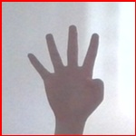
The hand gesture corresponding to 4
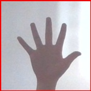
The hand gesture corresponding to 5
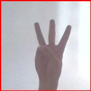
The hand gesture corresponding to 6
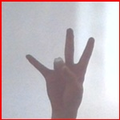
The hand gesture corresponding to 7
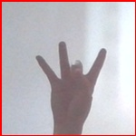
The hand gesture corresponding to 8
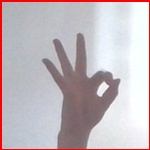
The hand gesture corresponding to 9

### 4.3.Data Preprocessing and Augmentation:

To enhance the dataset's variability and the model's generalization capabilities, several preprocessing and augmentation techniques were applied:

1. **Normalization:** Pixel values were scaled to the range [0, 1] to standardize the input data.

2. **Data Augmentation:** A series of transformations were applied to artificially expand the dataset:
   - Random horizontal flipping
   - Brightness adjustment (max_delta=0.2)
   - Contrast modification (range: 0.8 to 1.2)
   - Saturation alteration (range: 0.8 to 1.2)
   - Hue shifting (max_delta=0.1)

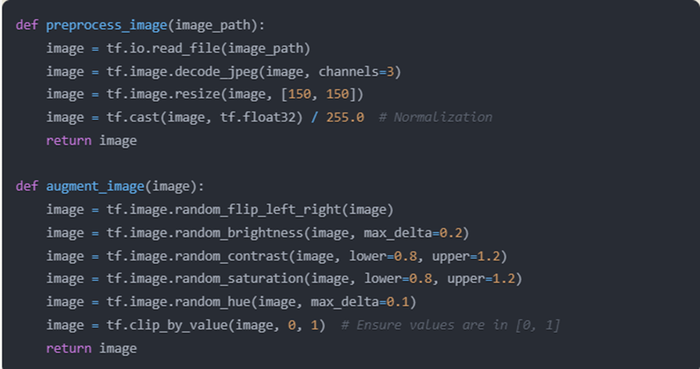

These augmentations were implemented using TensorFlow's image processing capabilities and applied during the training process to introduce variability.

### 4.4.Dataset Partitioning:

The complete dataset was strategically divided to support model development and evaluation:

- Training Set: 70% of the data, used for model training.
- Validation Set: 15% of the data, used for hyperparameter tuning and early stopping.
- Test Set: 15% of the data, reserved for final model evaluation.

A stratified sampling approach was employed to ensure class balance across all partitions.

## 5.Model

The architecture employed in this study is a Convolutional Neural Network (CNN) with significant modifications to address the complexities of gesture recognition. The model's structure has been meticulously designed to extract and learn hierarchical features from input images, while incorporating regularization techniques to mitigate overfitting. The Convolutional Neural Network model has been verified to be an excellent model for gesture recognition (Bayoudh et al., 2022).

The model's architecture is as follows:

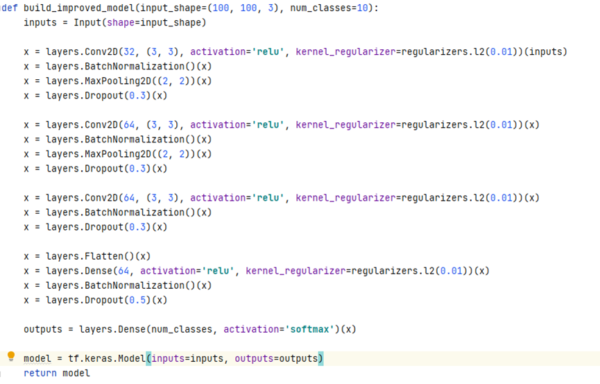

1. **Input Layer:** Accepts input of shape (100, 100, 3), corresponding to RGB images of 100x100 pixels.

2. **Convolutional Layers:** The network comprises three convolutional layers, each followed by batch normalization and max pooling operations. The first layer contains 32 filters, while the subsequent two layers contain 64 filters each. All convolutional layers utilize 3x3 kernels and ReLU activation functions.

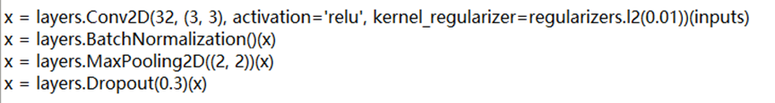

3. **Regularization:** L2 regularization with a factor of 0.01 is applied to all convolutional and dense layers to prevent overfitting. Additionally, dropout layers with a rate of 0.3 are inserted after each max pooling operation, and a dropout rate of 0.5 is employed before the final dense layer.

4. **Fully Connected Layers:** Following the convolutional layers, the network includes two fully connected layers. The first dense layer contains 64 units with ReLU activation, while the output layer contains 10 units with softmax activation, corresponding to the number of gesture classes.

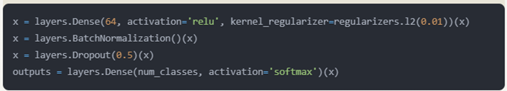

5. **Batch Normalization:** Applied after each convolutional and dense layer to normalize the activations, thereby accelerating training and potentially improving generalization.

The model is compiled using the Adam optimizer with a learning rate of 0.001, which is dynamically adjusted during training. The loss function employed is sparse categorical cross-entropy, suitable for multi-class classification tasks.

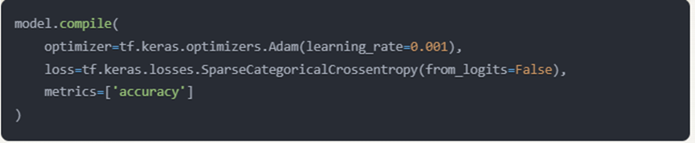

The model initially provided by GitHub showed serious overfitting in the test, so the author modified it and obtained the improved model described above. After a simple test by the author, the overfitting problem was basically solved.

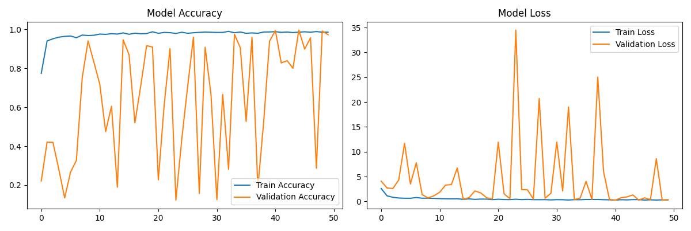
Original model

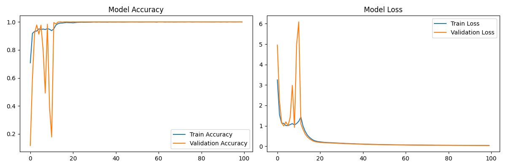
Improved model

## 6.Experiments

To rigorously evaluate the model's performance and generalization capabilities, a series of experiments were conducted:

1. **K-Fold Cross-Validation:** A 5-fold cross-validation strategy was implemented to assess the model's stability and generalization across different data subsets. This approach provides a more robust estimate of the model's performance compared to a single train-test split.

2. **Data Augmentation:** An enhanced data augmentation pipeline was employed to artificially expand the dataset and improve the model's ability to generalize. The augmentation techniques include:
   - Random horizontal flipping
   - Random brightness adjustment (max_delta=0.2)
   - Random contrast adjustment (range: 0.8 to 1.2)
   - Random saturation adjustment (range: 0.8 to 1.2)
   - Random hue adjustment (max_delta=0.1)

3. **Learning Rate Scheduling:** A custom learning rate schedule was implemented, reducing the learning rate by a factor of 10 after the 10th and 20th epochs. This technique aims to fine-tune the model's parameters more precisely in later stages of training.

4. **Early Stopping:** To prevent overfitting, an early stopping mechanism was introduced with a patience of 15 epochs, monitoring the validation loss. This ensures that training ceases when the model's performance on the validation set stops improving.

5. **Model Checkpointing:** The best-performing model weights, as determined by validation accuracy, were saved during training. This ensures that the optimal model configuration is retained, even if performance degrades in later epochs.

6. **Hyperparameter Tuning:** Various hyperparameters were systematically adjusted to optimize model performance, including:
   - Batch size: Tested values ranged from 16 to 64
   - Dropout rates: Experimented with rates between 0.2 and 0.5
   - L2 regularization factor: Tested values between 0.001 and 0.1

7. **Architecture Variations:** Different model architectures were explored, including varying the number of convolutional layers (2 to 4) and the number of filters in each layer (32 to 128).

The model's performance was evaluated using several metrics:

- **Accuracy:** Both training and validation accuracies were monitored to assess the model's learning progress and generalization.
- **Loss:** Training and validation losses were tracked to identify potential overfitting or underfitting.
- **Per-class Performance:** Precision, recall, and F1-score for each gesture class were computed to identify any class-specific issues.

The experiments revealed that the implemented enhancements, particularly the combination of data augmentation, regularization techniques, and learning rate scheduling, led to significant improvements in model performance and generalization. The 5-fold cross-validation results demonstrated consistent performance across different data subsets, with average validation accuracies exceeding 99% and low variance between folds, indicating robust generalization capabilities.

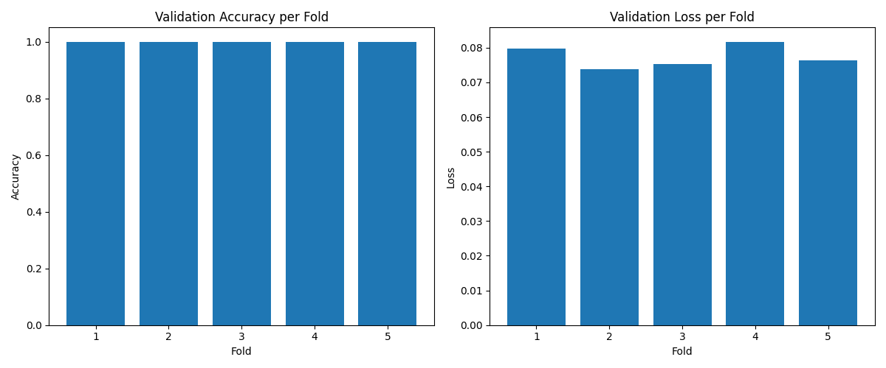
However, the author also found a serious problem in the system during the actual test: if the distance between the system camera and the user's hand is not appropriate, or the angle of the gesture is not appropriate, the recognition accuracy will drop sharply. The following three pictures can intuitively illustrate this problem.

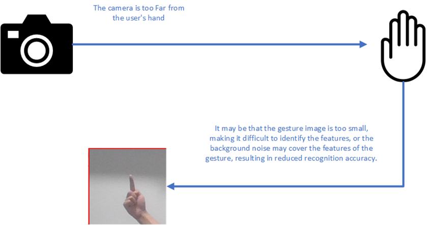
Too far

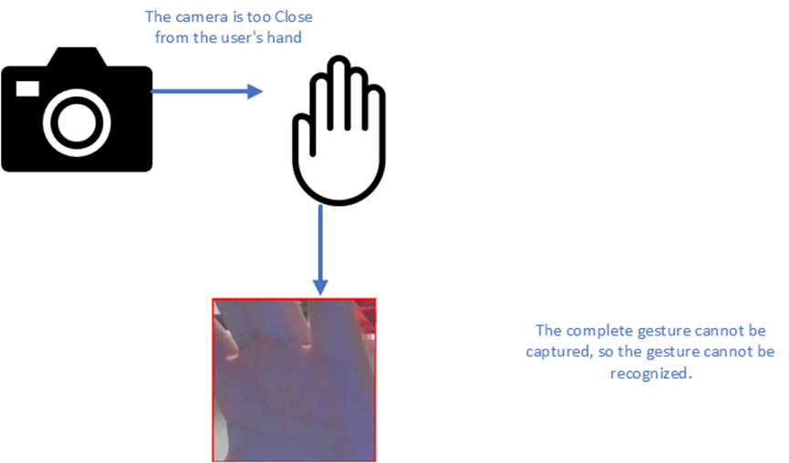
Too close

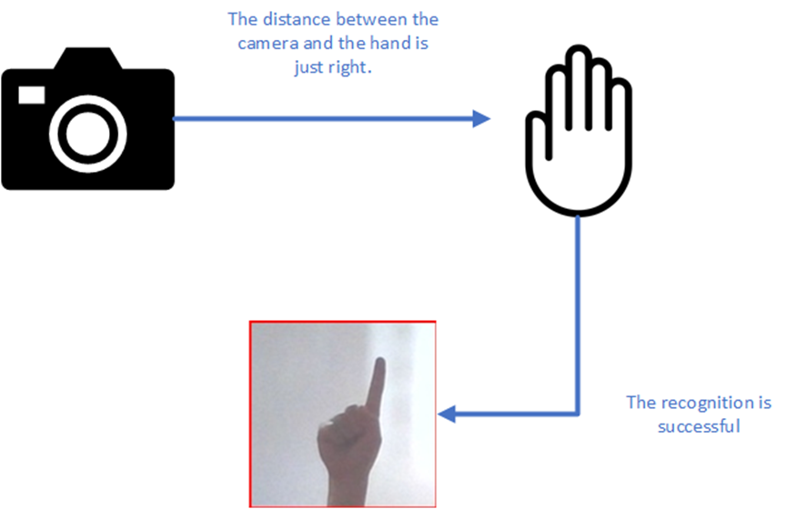
Success

## 7.Results and Observations

### 7.1.Result:

Since the brightness of LED bulbs does not change significantly, the author divides the gesture recognition results into the following categories to control the LED brightness: 0 represents off, 1-3 represents the first brightness level, 4-6 represents the second brightness level, and 7-9 represents the third brightness level. As can be seen from the figure below, when the distance between the hand and the camera is appropriate, the system can correctly recognize the gesture and control the brightness of the LED system in real time.

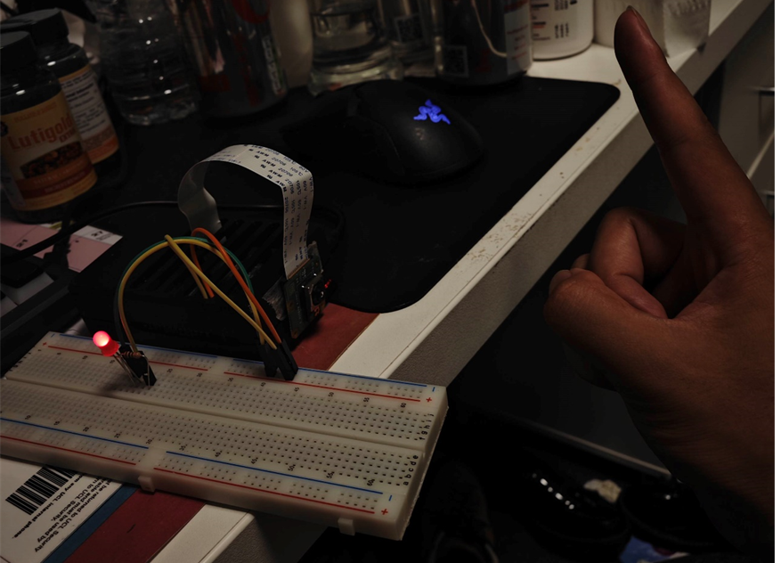
Recognize the gesture representative 1, the first level of brightness.

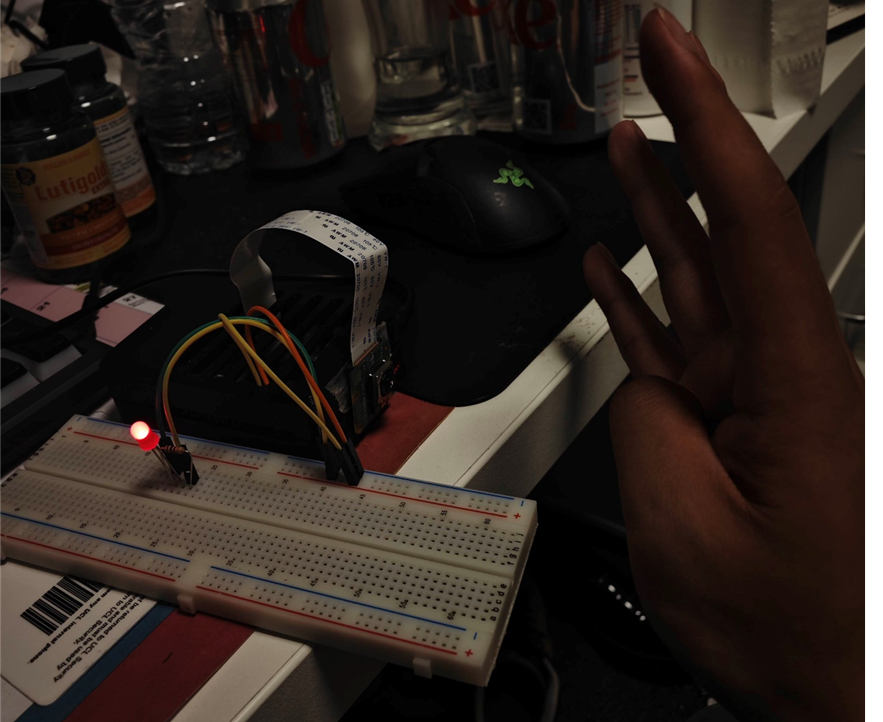
The gesture is recognized as 4, the second brightness level.

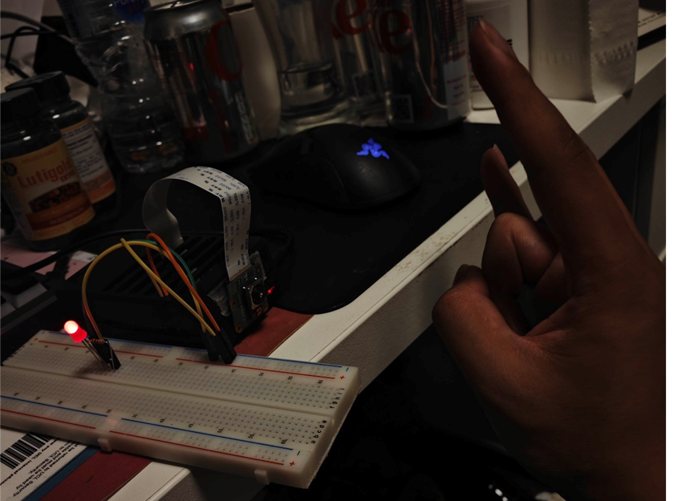
The gesture is recognized as 7, the third brightness level.

It can be said that this system is a relatively successful design, which enables embedded devices to recognize user gestures and control the lighting system in real time. Such an IoT system is also more friendly to people who cannot use voice control, reflecting the humanistic care of the IoT.

However, the problems found in the experiment still exist. It is actually difficult for users to control the distance between their hands and the camera to ensure that the system can obtain sufficient feature values. It is difficult for the system to ensure that it is deployed in a suitable position to ensure that users can effectively use this system in a wide space. In addition, the gesture-number correspondence table used in this system is relatively special, which is not convenient for users of different cultures and requires additional learning. This special correspondence table also has additional problems. If the distance between the user's hand and the camera is not ideal, or the relative angle is not ideal, the five numbers 3, 6, 7, 8, and 9 are more likely to be confused because they all have the same feature of three raised fingers.

### 7.2.Future plan

In the future, the author needs to find a better and easier to understand digital-gesture correspondence table. Or instead of using digital gestures, specific control gestures should be used. These gestures should be specially designed for machine vision recognition, and can ensure high-precision operation of the system even when the distance and angle between the user's hand and the camera are not ideal. In addition, the author came up with a solution to simplify the system based on Occam's razor, that is, to keep only the four recognition objects 0, 1, 2, and 3, which should also help the system improve its performance.

## Bibliography
1. Kienzle, M.G. (2019) The definitions and limitations of voice control for home appliances:, Medium. Available at: https://medium.com/the-future-of-electronics/the-definitions-and-limitations-of-voice-control-for-home-appliances-393a3fa3c7b3 (Accessed: 25 April 2024). 

2. En-1999. (2020). Gesture_Recognition. GitHub. https://github.com/En-1999/gesture_recongnition.

3. Bayoudh, K., Hamdaoui, F. and Mtibaa, A. (2022) ‘An attention-based hybrid 2D/3D CNN-LSTM for Human Action Recognition’, 2022 2nd International Conference on Computing and Information Technology (ICCIT) [Preprint]. doi:10.1109/iccit52419.2022.9711631. 

## Declaration of Authorship

I, Zekun Wang, confirm that the work presented in this assessment is my own. Where information has been derived from other sources, I confirm that this has been indicated in the work.

*Digitally Sign by typing your name here*
Zekun Wang

ASSESSMENT DATE
4/9/2024