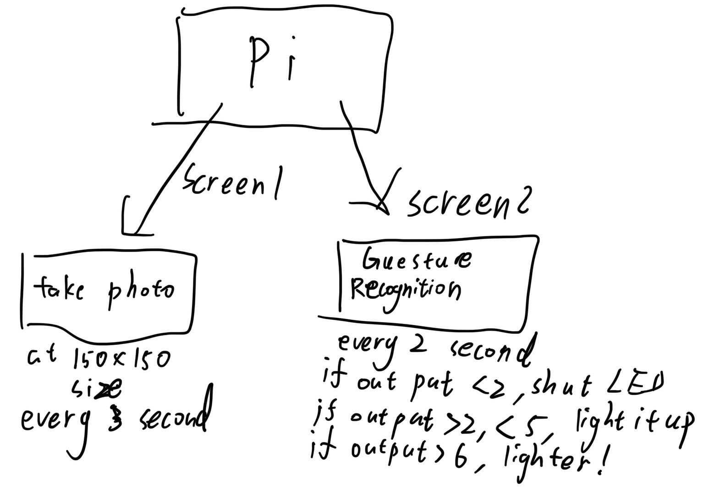
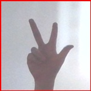
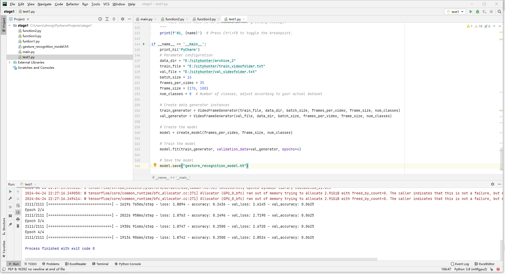
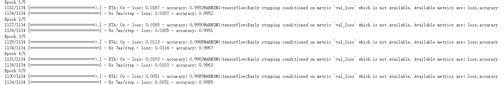
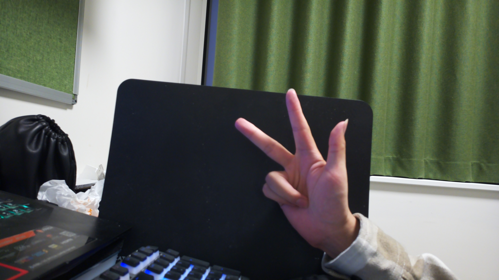
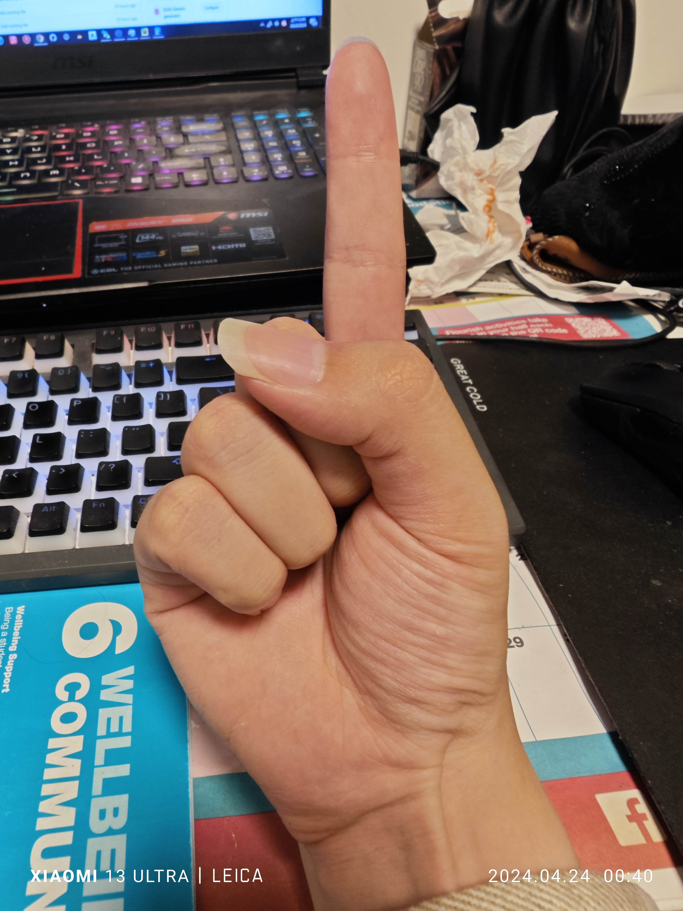
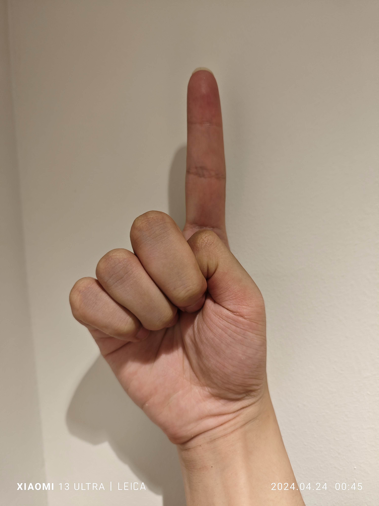

# Gesture_Lightkeeper for CASA0018

Zekun Wang 
[Here is the link to github](https://github.com/AntiRain114/Lightkeeper)

## Introduction
The goal of LightKeeper is to give embedded systems the ability to control lights through gesture recognition based on pre-trained tensorflow lite models. Users should be able to use special gestures to control the lighting system, allowing the smart lighting system to provide users with more convenient services. In the smart home market, there is no shortage of products that can control lighting systems, but most of them rely on voice recognition functions, which require users to express their thoughts and correctly identify them before they can control the lighting system. This method is not fast enough and can be improved to be more convenient(Kienzle, 2019). After learning tensorflow lite and studying the examples provided by tensorflow official, I got the inspiration for this project. The project can be roughly divided into two phases. The first phase is based on the work identification produced by 20bn-jester(Qualcomm, n.d.), and the code is completely rewritten by the author. However, since the model was far from ideal, the author chose the second option. This solution is based on the gesture_recongnition project(En-1999, 2020) on github and controls the lighting system by identifying the numbers represented by specific gestures.On the Github page, the stage1 folder contains the first-stage training script. Because the training set and trained model are too large, they cannot be uploaded. The stage2 folder contains the files of the second stage. pifile places the files used to deploy the Raspberry Pi. The rest of flutter are files that try to deploy the system on the mobile phone.

## Research Question
There are three main problems to be solved. The first is to ensure high accuracy during model testing, which is the basis for subsequent work. The second issue is ensuring that the program can run correctly on the Raspberry Pi, which is also a challenge due to changes in development environments and packages. The third problem is to ensure the high performance and high recognition accuracy of the system in actual experiments.

## Application Overview
The system built in this project mainly includes three hardware parts and two software modules. The hardware module of the system consists of a camera module, a Raspberry Pi, and LEDs that simulate an intelligent lighting system. The software mainly consists of two python scripts, which are placed in the same folder. Since the picamera2 package and tensorflow_runtime package on the Raspberry Pi are difficult to use at the same time, the author chose to create two independent screen windows, one in the system Run the image capture script in the python environment and store the image in the same path as the script; the other reads the captured image from the folder, identifies it, and then uses the GPIO package to control the switch and brightness of the LED that simulates the intelligent lighting system(Jindal et al., 2022). This results in a certain delay in the system and can only be used as a temporary compromise.

Figure 1: Hardware components

Figure 2: Software components

## Data
For the first phase of the project, the authors are using the 20bn-jester dataset. This data set is a gesture motion captured frame by frame from a large number of videos, and the amount of data is very large. These data are placed in different folders, each folder is named the number of the video, and the file name of each picture in the folder is determined according to the chronological order of the video. Therefore, different videos will produce different numbers of screenshots, and the image file names may even be discontinuous. The author must use a special script to ensure that the file names are continued. And before training the model, the number of input pictures is specified. For those with more than one, non-key frames are removed, and for those with insufficient, all black pictures are added. In the second stage, the data used in gesture_recongnition has been well processed. The gesture images symbolizing 0-9 are stored in corresponding folders named 0-9 respectively, and no additional processing is required. However, the amount of data is smaller than 20bn-jester.

Figure 3: Training set for Stage1

Figure 4: Training set for Stage2

## Model
For the first stage model, the complexity of capturing the spatial and temporal dimensions is very high for the field of video action recognition. To address these challenges, different neural network architectures are employed to take advantage of each architecture's unique advantages in processing complex video data. The authors tried many model structures, but the resulting models were of poor quality. The author has tried 3D-CNN, 2D-CNN+LSTM, and tried to build a ResNet3D model by himself. 3D Convolutional Neural Networks (3D-CNN) are designed to capture the time course of frames in a video by adding a third dimension (time) to the convolutional layers. This enables the model to process a sequence of frames as a single input, extracting features that encapsulate motion information and spatial features, making the method well suited for gesture recognition in video(Zhang et al., 2020). Combining 2D-CNN with an LSTM (long short-term memory) network is a hybrid approach where 2D-CNN is used to extract spatial features from individual frames, and then the sequential outputs of these convolutional layers are fed into the LSTM to capture dynamic temporal relationships(Bayoudh et al., 2022). This combination leverages the strengths of CNNs in feature detection and the ability of LSTMs to handle sequence predictions. ResNet3D is an adaptation of the highly successful ResNet architecture for 3D data, which incorporates residual learning to help train deeper networks by using skip connections, or shortcuts to skip certain layers. In video action recognition, ResNet3D modifies standard ResNet by replacing 2D operations with 3D equivalent operations to effectively handle the temporal dimension and enhance the model's ability to learn richer and more complex spatiotemporal features(Huang & Cai, 2023). For 20bn-jester, according to the kagge rankings, ResNet3D101 can achieve the best results. However, the model performance of the three weeks trained by the author himself was very poor, among which 2D-CNN+LSTM performed the best. When the author tried to call the preset resNet3D model in the tensorflow_model package, the author's virtual environment was completely destroyed due to incompatible package versions. The effect is not ideal, and it takes more time to adjust the model algorithm or use the visual Transformer algorithm. The accuracy of this model is very low. For the second stage model, 2D-CNN is used to achieve recognition. As mentioned earlier, 2D-CNN can extract spatial features from images very well. The model performs very well in the validation set, but performs very erratically in the experimental set.

Figure 5: Result fot satge1

Figure 6: Result fot satge2

## Experiments
The first-stage model performed poorly on the validation set, with a maximum accuracy of 25%. Therefore there is no need to conduct experiments. The author only describes the model of the second stage here. First of all, the author used the pictures taken by his mobile phone as the experimental set to test the quality of the model. The effect is very long, because the pictures in the training set are all 150 pixels * 150 pixels, and the pixels of the author's mobile phone are too high, which will produce unnecessary noise after scaling. feature. Therefore, the performance in this experimental set was also very poor. None of the 10 photos taken by the author could be successfully detected. The author then used the training material capture script used by the original author of the project to create a second experimental set, but the recognition accuracy was still very low. The author then changed the solid color background and used material capture software to create a third data set, directly achieving good recognition accuracy.
The author then deployed the model on the Raspberry Pi and used the Raspberry Pi's camera to conduct experiments. After looping the shots, the accuracy rate was very low.Currently, in the case of complex backgrounds and uncertain recognition distances, this system can only control the switch of LED bulbs and cannot accurately control the brightness adjustment.

Figure 7: Test set1

Figure 8: Test set1

Figure 9: Test set2

Figure 10: Test set3

Figure 11: Test set3

## Results and Observations
Experimental results highlight the importance of training data quality and diversity to achieve robust gesture recognition performance. The model performed well on the training set and similar datasets, but did not perform well on real-world scenes captured by the Raspberry Pi camera. This observation suggests that the training data lacks sufficient diversity in terms of background complexity, lighting conditions, and gesture variations.
The poor performance on the author's mobile images also indicates that the model is sensitive to image resolution and scaling. This sensitivity can be attributed to the fixed input size used during training (150x150 pixels), which may result in the loss of important features when scaling down high-resolution images.
The improved accuracy achieved using a solid color background in the third dataset demonstrates the impact of background complexity on gesture recognition. This finding shows that the model relies heavily on background context and has difficulty isolating gestures from complex backgrounds.
Such a model results in the current system only being able to control the switching of LEDs but not brightness control, which shows the need to iterate on more advanced models.
For future improvements, the author mainly considers the following points:
1. Make a new training dataset: Use the Raspberry Pi camera to collect more diverse gesture images with a variety of backgrounds, lighting conditions, and gesture variations. This will help improve the model's ability to cope with different scenarios, while also adapting to the shooting conditions of the deployed equipment.
2. Add background subtraction or attention mechanisms, which should be able to minimize the impact of the background on gesture recognition.
3. Select existing large data sets to be hosted in a professional cloud model training center to train efficient models.
4. Reset the Raspberry Pi system so that it can run a program that simultaneously performs image capture and gesture recognition and controls the lighting system.
5. Razer or projection equipment can be installed around the Raspberry Pi camera to allow users to understand where the appropriate capture range is to improve efficiency.

## Bibliography

1. Kienzle, M.G. (2019) The definitions and limitations of voice control for home appliances:, Medium. Available at: https://medium.com/the-future-of-electronics/the-definitions-and-limitations-of-voice-control-for-home-appliances-393a3fa3c7b3 (Accessed: 25 April 2024). 

2. Qualcomm. (n.d.). Jester Dataset. Retrieved from https://developer.qualcomm.com/software/ai-datasets/jester

3. En-1999. (2020). Gesture_Recognition. GitHub. https://github.com/En-1999/gesture_recongnition.

4. Jindal, A., Kumar, N. and Aujla, G.S. (2022) Internet of energy for smart cities: Machine learning models and techniques. Boca Raton, FL: CRC Press/Taylor & Francis Group. 

5. Zhang, Y. et al. (2020) ‘Gesture recognition based on deep deformable 3d Convolutional Neural Networks’, Pattern Recognition, 107, p. 107416. doi:10.1016/j.patcog.2020.107416. 

6. Bayoudh, K., Hamdaoui, F. and Mtibaa, A. (2022) ‘An attention-based hybrid 2D/3D CNN-LSTM for Human Action Recognition’, 2022 2nd International Conference on Computing and Information Technology (ICCIT) [Preprint]. doi:10.1109/iccit52419.2022.9711631. 

7. Huang, X. and Cai, Z. (2023) ‘A review of video action recognition based on 3D convolution’, Computers and Electrical Engineering, 108, p. 108713. doi:10.1016/j.compeleceng.2023.108713. 

## Declaration of Authorship

I, Zekun Wang, confirm that the work presented in this assessment is my own. Where information has been derived from other sources, I confirm that this has been indicated in the work.

*Digitally Sign by typing your name here*
Zekun Wang

ASSESSMENT DATE
25/4/2024

Word count: 
